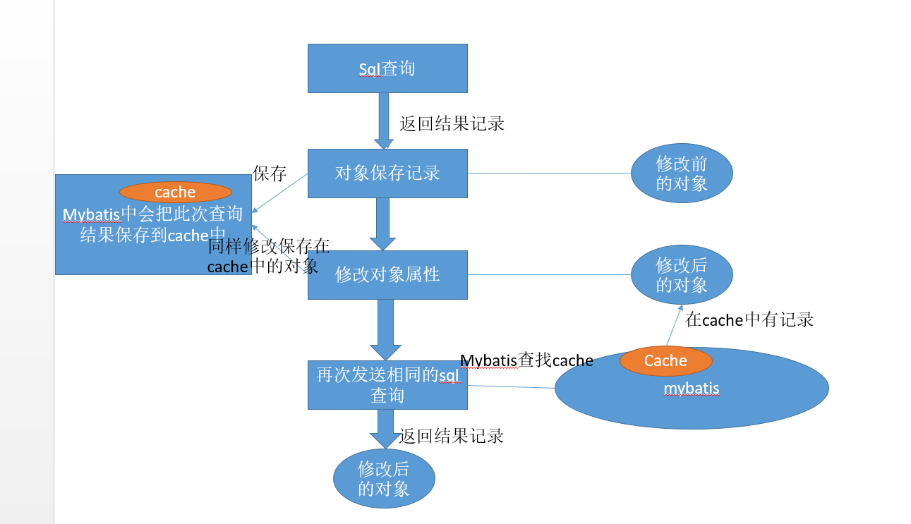

### 记录关于mybatis的LocalCache问题

#### 场景：

当使用mybatis向mysql查找记录并返回记录时，如果使用对象保存记录值，这时如果因业务需要修改了对象的某个值，并且当前方法再次调用同样的查询方法获取记录，那么mybatis并不会发送sql请求获取数据，返回的记录并不是数据库的值，而是保存在mybatis内部的cache属性中并且修改过的记录。由于数据有改动，那么可能会对业务出现不正确的情况。

#### 出现原因：

由于mybatis的本地缓存（LocalCache 也叫一级缓存）。在cache中保存的对象为对象的引用，当对象被修改时相应的cache也被修改了。因此当再发送相同的sql语句进行查询时，mybatis检测到cache中有对应记录，则不会再执行sql语句，而是直接返回该对象的引用（此时对象已经是被修改后的对象）。

#### 解决方法：

1、在业务方法上不使用@Transactional注解

2、修改localCacheScope的值为STATEMENT

3、在mapper配置文件中，给select设置`flushCache=true`。需要注意的是，这样会将local cache和cache都清空掉。

具体可以参考（<https://segmentfault.com/a/1190000008207977>）