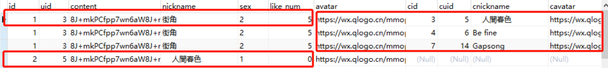

### 记录关于只用一张数据表就实现获取评论的sql语句

#### 数据库表：

留言表：


说明：user_id和reply_id都关联user表的id，前者表示发表这条评论的用户，后者代为被回复的用户，当reply_id为0时表示顶层评论。index表示回复的楼号。party_id为评论的载体，比如某个微博或者视频下面的评论。

#### 实现思路：

1、首先获取顶层评论，以index=0作为控制

2、以顶层评论为基础join非顶层评论（index！=0），并确保join结束之后还能得到全部的顶层评论，如果该评论没有被回复则保留为null

3、把获取到评论结果join用户表获取具体数据

#### sql语句实现：

```sql
		SELECT b.id,b.uid,b.content,b.nickname,b.sex,b.like_num,b.avatar,
			b.cid,ua.id AS cuid,ua.nickname AS cnickname,ua.avatar AS cavatar,ua.sex AS csex,
		    b.content1 AS ccontent,ub.nickname as crnickname,b.clikeNum,
		    b.reply_id,b.`index`
        FROM
        (
        SELECT a.id,a.uid,a.content,a.nickname,a.avatar,a.sex,a.like_num,
				a.`create`,
				pct.content as content1,pct.user_id,pct.reply_id,pct.`index`,pct.id as cid,
				pct.like_num AS clikeNum
        FROM party_comment AS pct
        RIGHT  JOIN  #使用right join确保获取完顶层评论
        (SELECT pc.id,`user`.id AS uid,`user`.nickname,`user`.avatar,`user`.sex,
				pc.content,pc.index,pc.like_num,pc.`create`
        FROM party_comment AS pc
        LEFT JOIN `user` ON `user`.id = pc.user_id
        WHERE pc.party_id = #{partyId}
        AND pc.index = 0) AS a ON  pct.index = a.id
        WHERE pct.party_id = #{partyId}
        OR (a.index = 0)  #这里or表示也把顶层评论获取出来
		ORDER BY a.`create` ASC,pct.`create` ASC #排序
        ) AS b  
        LEFT JOIN `user` AS ua ON ua.id = b.user_id
        LEFT JOIN `user` AS ub ON ub.id = b.reply_id
```

#### 注意：

获取出来的记录在navicat中显示其实是一对多的关系，要抽象查看（根据index相同查看）



圈出来的部分其实有五条评论。

